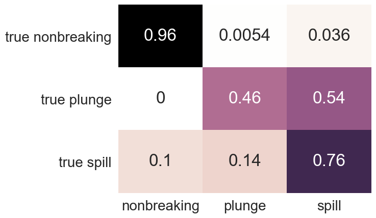

# Precomputation of Image Features for the Classification of Dynamic Properties in Waves

Repositiory for code to reproduce the results of the pre-print Precomputation of Image Features for the Classification of Dynamic Properties in Waves

## Contents

[Precomputation of Image Features for the Classification of Dynamic Properties in Waves](#precomputation-of-image-features-for-the-classification-of-dynamic-properties-in-waves)

- [1. Environment](#1-environment)
- [2. Data](#2-data)
    - [2.1. Sources](#21-sources)
    - [2.2. Folder Structure](#22-folder-structure)
- [3. Models](#3-models)
- [4. Training](#4-training)
- [5. Evaluation](#5-evaluation)
    - [5.1. Evaluating](#51-evaluating)
    - [5.2. Results](#52-results)
- [6. Scripts](#6-scripts)
    - [6.1. Seperate Waves](#61-seperate-waves)

---

## 1. Environment

Creating a virtual environment to install the dependencies packages is recommended, this can be done with either conda or the python3 venv.

### Using [`conda`](https://docs.conda.io/en/latest/)

```bash
conda env create -f environment.yml
conda activate precomputation
```

### Using [`pip`](https://pypi.org/project/pip/)

```bash
python3 -m venv precomputation
source precomputation/bin/activate
pip install -r requirements.txt
```

<details>
    <summary>Package list</summary>

    - h5py
    - keras
    - keras
    - matplotlib
    - numpy
    - pickleshare
    - pillow
    - scikit-learn
    - scipy
    - seaborn
    - tensorflow
    - albumentations

</details>

---

## 2. Data

### 2.1. Sources

Data is available to download from the [IR_Waveclass](https://github.com/dbuscombe-usgs/IR_waveclass) repository on github with the original train/test split. It is also supplied at [Zenodo](doi.org/10.5281/zenodo.5361958) using the data split described in our respective paper.  The extracted features are also available in the /out folder at the Zenodo link. A bash script is also provided for grouping together waves. We then hand split the waves into train and test groups to get the desired split ratio.  **Note: Running scripts/seperate_waves on the original data will not give the exact same data split. Some images were manually moved around to other classes (mislabeled in the original data split). This was found by running seperate_waves on the original split when it becomes apparent that some of the collected waves are only a single image long.  It was also found that some images were unusable.** For information on the included bash scripts see [scripts](#6-scripts)

### 2.2. Folder Structure

After downloading the repository and the data files from [Zenodo](doi.org/10.5281/zenodo.5361958) the folders will look as below (files ommitted).

<details>
<summary>conf : contains the config files for each model, each comes with the following parameters</summary>

- model name of pretrained CNN to be used
- weights to be used on the CNN model
- include top - to use the fully connected layer on the CNN (set to false)
- train path of images for training
- test path of images for testing
- features path where to save features extracted from train images
- lables path where to save labels of train images
- test features where to save features of test images
- test labels where to save labels of test images
- results where to results report
- classifier path where to save the classifier model
- imaug whether to use image augmentation
- extraction func single, two IR or IR and OF image inputs

</details>

<details>
<summary>data : contains the IR images and the images generated by TV-L1 Optical flow</summary>

- flow : are the TVL1 optical flow images
    - test
    - train
- IR : original IR images
    - test
    - train
- spyflow : are the SPyNet optical flow images
    - test
    - train

</details>

<details>
<summary>figures : figures generated</summary>

- cluster : contains UMAP clusterings of the data
- cm : contains the confusion maps from results section
- missed : examples of images misclassified

</details>

<details>
<summary>notebook out : figures generated from the ipynb</summary>

- nonbreaking : evolution of probabilities over wave displayed with respective sample for each model
- plunge : evolution of probabilities over wave displayed with respective sample for each model
- probabilities : evolution of probabilities and brier score for each model on each class
- spill : evolution of probabilities over wave displayed with respective sample for each model

</details>

<details>
<summary>out</summary>

- mobilenet
- xception
    - models : contains the pickle file for each classifier
    - h5files : contains the labels and features files for each classifier
    - results : contains the txt files for each classifier

</details>

<details>
<summary>scripts</summary>

- seperate_waves

</details>

---

## 3. Models

The Xception pre-trained CNN was found to have the best performance on the data set and was used for all feature extractions in the results section.  We then fit a logistic regression model which is saved in the /out folder under the respective CNN model. The classifiers are stored as pickled objects and can be freely loaded with the pickle package. In this experiment we have train 5 classifiers which differ by their inputs, (IR, TV-L1, SPyNet, IR+IR, IR+TV-L1).

- IR : A single infra-red image as the input to the CNN
- TV-L1 : Two sequential infra-red images are given to the TV-L1 optical flow algorithm. The output flow visualisation then has its features extracted by the CNN
- SPyNet : The optical flow calculation is now optimised by the CNN SPyNet
- IR+IR : Two infra-red images have their features extracted and joined before input to the logistic regression model
- IR+TV-L1 : An infra-red image and the respective flow visualisation from TV-L1 are input to the CNN for feature extraction.

---

## 4. Training

There are config files supplied for two CNNs (Mobilenet_v2 and Xception) for each of the models (IR, TVL1, SPyNet, IR+IR and IR+TVL1). Other pre-trained CNNs available in Tensorflow can also be used by creating a config file and adding a similar conditional in the utils file for selecting the model.  To train a model, first call the python file for extracting the features using a pre-trained CNN.  This is done by giving the config file name (without ".json") as an argument to the program as below.

```bash
python extract_CNN_features.py -c CONFIG_FILE
python train_model.py -c CONFIG_FILE
```

The second command will train the model specified in the same config file.

Additionally, all the configs in /conf can be run by running the following command in the command line.

```bash
./run_all_configs
```

This will extract the features, train the model and test all the models.

---

## 5. Evaluation

### 5.1. Evaluating

The test python file is used for generating the results figures and evaluating the models.  This is done using the same structure as before and supplying the config file as an argument to -c or --config.

```bash
python test.py -c CONFIG_FILE
```

If the test features have already been extracted, it is possible to also just run the test and generate the results based on these features by also supplying the -e or --extract with "n".

```bash
python test.py -c CONFIG_FILE -e n
```

### 5.2. Results

#### **Table of Metrics**

Results presented in the paper are given below. In the table, the figures in brackets are from the respective augmented models.  Informdness and Brier score were only calculated for the non-augmented models.

| Model | Class | Precision | Recall | F1 score | Informedness | Brier score  |
| - | - | - | - | - | - | -  |
| IR | Non-breaking | 0.97 (0.96) | 0.94 (0.93) | 0.95 (0.95) | 0.87 | 0.09  |
| _ | Plunge | 0.33 (0.30) | 0.42 (0.47) | 0.37 (0.37) |   0.41  |  0.97  |
| _ | Spill | 0.80 (0.79) | 0.85 (0.83) | 0.82 (0.81) |  0.79   |  0.22  |
| TV-L1 | Non-breaking | 0.98 (0.98) | 0.96 (0.96) | 0.97 (0.97) | 0.90  |  0.06  |
| _ | Plunge | 0.32 (0.30) | 0.59 (0.57) | 0.42 (0.39) | 0.58 | 0.70  |
| _ | Spill | 0.85 (0.85) | 0.86 (0.85) | 0.85 (0.85) | 0.81  | 0.22  |
| SPyNet | Non-breaking | 0.97 (0.97) | 0.96 (0.96) | 0.96 (0.96) | 0.87 | 0.06  |
| _ | Plunge | 0.15 (0.14) | 0.46 (0.46) | 0.22 (0.22) | 0.43 | 0.92  |
| _ | Spill | 0.84 (0.84) | 0.76 (0.76) | 0.80 (0.80) | 0.72 | 0.33  |
| IR + IR | Non-breaking |  0.98 (0.97) |  0.96 (0.95) | 0.97 (0.96) |  0.89  | 0. 08 |
| _ | Plunge |  0.39 (0.34) |  0.43 (0.49) | 0.41 (0.40) |  0.42  | 1.01  |
| _ | Spill |  0.84 (0.82) |  0.89 (0.87) | 0.86 (0.84) |  0.83  | 0.24  |
| IR + TV-L1 | Non-breaking | 0.98 (0.98) | 0.97 (0.97) | 0.98 (0.98) | 0.90  | 0. 05 |
| _ | Plunge | 0.43 (0.36) | 0.41 (0.46) | 0.42 (0.40) | 0.48 | 0.91  |
| _ | Spill | 0.88 (0.88) | 0.92 (0.91) | 0.90 (0.89) | 0.86 | 0.12  |

#### **Probability Evolution**

By returning the probabilities from the logistic regression model we can track the classification probabilities over the course of each wave. The below figure shows this probability evolution for each classes waves and how the different classifiers compare.

| IR | TVL1 | IR+TVL1 |
| - | - | - |
|  | |  |
|  | |  |
|  | |  |

[prob legend](<notebook_out/probabilities/legend.png>)

#### **Confusion Maps**

Confusion maps for all Xception based models are presented below as in the paper.

| Model | Normal | Augmented |
| - | - | - |
| IR |  |  |
| TVL1 |  |  |
| SPyNet |  |  |
| IR+IR |  |  |
| IR+IR |  |  |

---

## 6. Scripts

### 6.1. Seperate Waves

This bash script contains a recursive function to collect all the images of a single wave together.  First, the train images should be combined with the test images (images in train/plunge/ and test/plunge/ should be combined in plunge/ and similar for nonbreaking and spill images). Then call the script with the path as the argument as follows.

```bash
./scripts/seperate_waves data/IR/plunge
./scripts/seperate_waves data/IR/spill
./scripts/seperate_waves data/IR/nonbreaking
```

This results in a folder structure like:

- data
    - IR
        - nonbreaking
            - wave_1
            - wave_2
            - ...
        - plunge
            - wave_1
            - wave_2
            - ...
        - spill
            - wave_1
            - wave_2
            - ...
    - ...

The script will create symbolic links to the images within these wave_* folders.

---

## [License](LICENSE)

<details>
<summary>MIT License</summary>

Copyright (c) 2021 Ryan Smith

Permission is hereby granted, free of charge, to any person obtaining a copy
of this software and associated documentation files (the "Software"), to deal
in the Software without restriction, including without limitation the rights
to use, copy, modify, merge, publish, distribute, sublicense, and/or sell
copies of the Software, and to permit persons to whom the Software is
furnished to do so, subject to the following conditions:

The above copyright notice and this permission notice shall be included in all
copies or substantial portions of the Software.

THE SOFTWARE IS PROVIDED "AS IS", WITHOUT WARRANTY OF ANY KIND, EXPRESS OR
IMPLIED, INCLUDING BUT NOT LIMITED TO THE WARRANTIES OF MERCHANTABILITY,
FITNESS FOR A PARTICULAR PURPOSE AND NONINFRINGEMENT. IN NO EVENT SHALL THE
AUTHORS OR COPYRIGHT HOLDERS BE LIABLE FOR ANY CLAIM, DAMAGES OR OTHER
LIABILITY, WHETHER IN AN ACTION OF CONTRACT, TORT OR OTHERWISE, ARISING FROM,
OUT OF OR IN CONNECTION WITH THE SOFTWARE OR THE USE OR OTHER DEALINGS IN THE
SOFTWARE.
</details>

---
